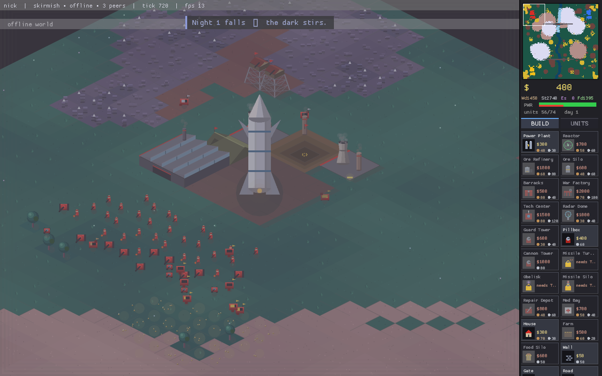
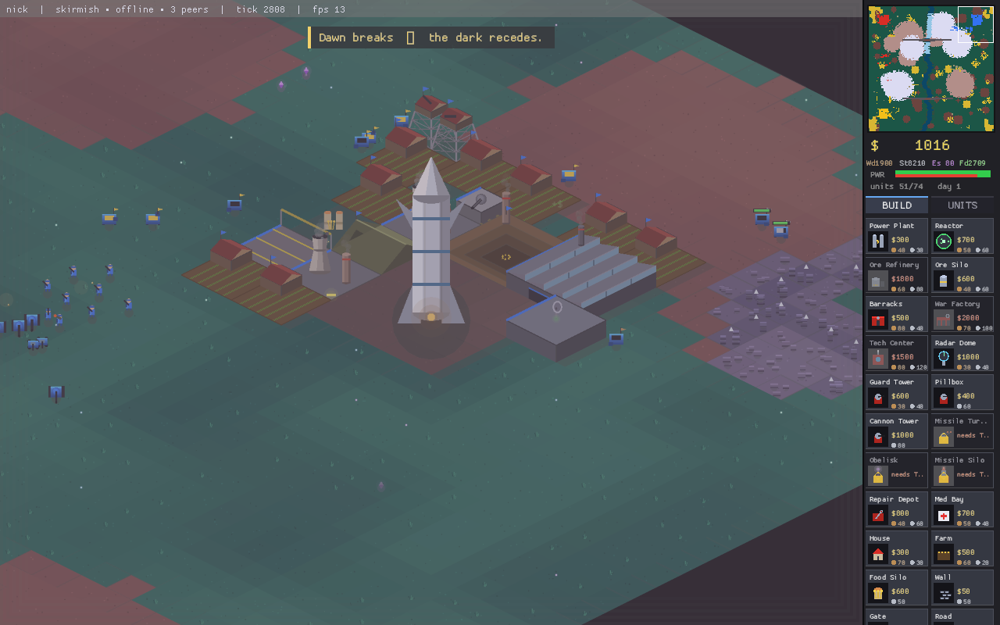
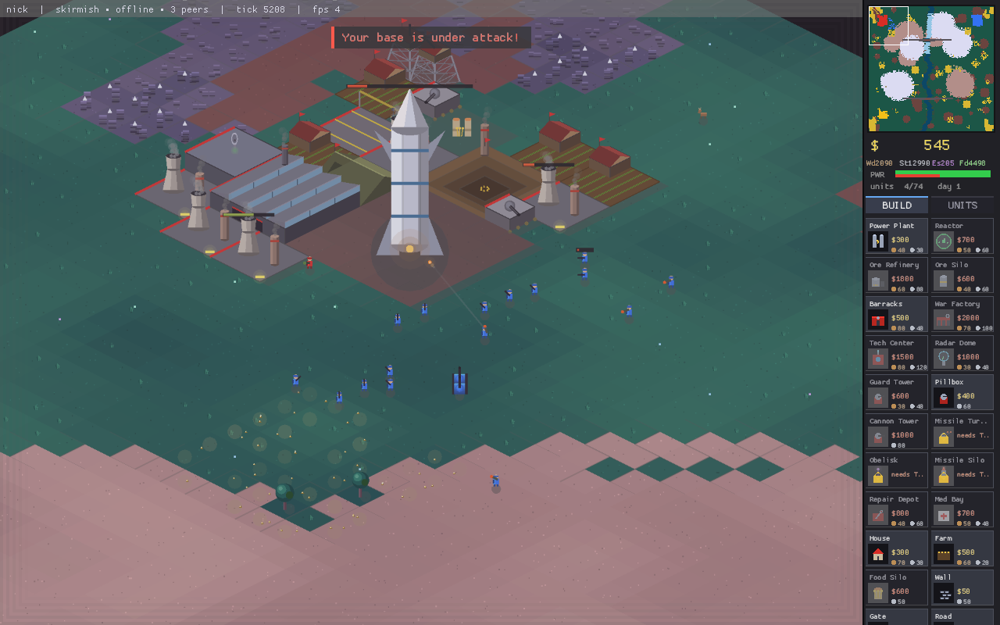

# IRONVEIN



**A persistent-world real-time strategy game on a frontier that never sleeps.**

Land your colonists on a new world, carve a base out of raw ore, timber and stone —
and hold it. Rival settlers want your ground. And when the sun goes down, something
older than all of you climbs out of the dark. Log off and the world keeps turning;
your colony stands until someone tears it down.

It's a love letter to the old Westwood RTS — ore trucks, war factories, "construction
complete" — with no server, no campaign, and no end screen. Just a living world with
its own clock, its own monsters, and a base with your name on it.

## ▶ Play right now, in your browser

**https://90stalgia.github.io/ironvein/**

No install, no download, no account. The whole game is WebAssembly served off a static
page — single-player and skirmish start instantly. Multiplayer is pure peer-to-peer
(WebRTC): you and your friends connect *directly*, with no lobby server and nothing to
host.

## The story of B-Proxima

### Planetfall

B-Proxima looked like salvation from orbit. Green continents, deep ore seams,
breathable air — a second chance after a long dark crossing. So the colony ships came
down: dropships full of settlers and machinery, the great armed **Starships** burning
through the cloud to set down hard in the dust. The first thing your people do on a new
world is plant a war factory.

You are not the only ones who saw it. Other nations launched their own arks for the
same prize, and they made landfall in the same valleys. Whatever treaties were meant to
carve up B-Proxima never survived contact with the ground. Within days the frontier is
a patchwork of rival colonies — harvesters fighting over the richest ore, engineers
slipping into each other's bases, guns already turned outward. The race to own a planet
has begun, and nobody came all this way to lose it.

### The dark

What none of the surveys caught — what nobody wanted to believe — is that B-Proxima was
never empty.

The first night, the dead walk. They come out of the treeline and the old places, slow
and patient: **zombies** that batter your walls until the sky goes grey and the dawn
burns them to ash. The settlers tell themselves it's a local hazard, a thing to be
fenced and forgotten. Then the nights get worse. **Werewolves** that close the distance
before your towers can swing. **Vampires** that drink the warmth out of a soldier and
leave a husk. Whatever this world is, it does not want to be colonised — and it has been
waiting a very long time.

There is power in killing the things that crawl out of the dark. The settlers learn to
harvest it: **Essence**, a cold arcane residue you refine into weapons that shouldn't
exist — death-ray Obelisks, champions out of legend. But the deeper you cut into
B-Proxima for it, the more the planet seems to *notice* you.

### The Warlock

The dead don't organise themselves. Something is conducting them.

First you meet the **Lich** — a caster that stalks the night raising your own fallen
against you, a foretaste of the intelligence underneath it all. And behind the Lich,
behind every shambling thing on this world, is the **Warlock**: B-Proxima's old master,
the hand on the strings, patient and immense. It has watched the nations carve up its
world and feed on its dark, and it has decided the experiment is over.

### The Reckoning

When the Warlock finally moves in force, the war between the colonies simply *stops*.
There's no time left to fight each other. Old enemies sound the same horn, lower the
same guns, and stand in one line — a last alliance of every nation on B-Proxima against
the thing that was here first.

And the Warlock answers in kind. Wounded but unbroken, it reaches into the wreckage of
the war you've all been waging and **seizes the machinery itself** — your tanks, your
hulls, your engines — and animates them. The dead climb into the cockpits. **Hell Tanks**
grind out of the night, corpses driving armour, your own arsenal turned against you. The
frontier collapses into one apocalyptic battle: the united colonies and everything they
can field, against an army of the dead in stolen steel.

Win, and B-Proxima is finally, uneasily, yours. Lose, and the planet goes back to sleep,
and waits for the next ship.

## What you actually do

Underneath the myth it's a deep, hands-on frontier RTS. A real logistics economy:
**harvesters** mine glittering ore into credits, crews **chop timber** and **quarry
stone**, **farms** grow food and **hunters** bring in meat — your soldiers eat, so a town
that can't feed itself starves. Refineries, power, radar, repair bays, war factories: the
full base-building loop, placed tile by tile, with fog of war, walls and gates, engineers
who capture, and bots that expand and raid.

Then you climb the tech tree, and the defenses get mean. A **Tech Center** unlocks the
good toys — long-range **Missile Turrets**, screaming **Tesla Coils** (high-voltage
zappers that melt armour and structures; they're power-hungry, so feed them from a
**Reactor**), and a map-wiping nuclear **Missile Silo**. And for those willing to farm the
dark for **Essence**, the arcane top tier opens: the death-ray **Obelisk** and the
one-soldier-army **Champion**.

And it's all made of *nothing*: every map is freshly generated, every sprite is drawn in
code, and every sound — the soundtrack, the gunfire, even the title theme — is synthesised
at runtime. No art files, no audio files, no servers. Nothing is downloaded; nothing is
shipped.

## Three ways to play

- **Persistent** — the headline mode. Drop into a shared, always-on world where your base
  outlives your session and the war never really stops. Every peer autosaves the identical
  world once a minute, so *anyone's* save can re-host it — and a tiny headless **seed node**
  can keep a world alive 24/7 on a spare box.
- **Skirmish** — classic deathmatch against bots that expand, harvest, build armies and
  raid across the river.
- **Survival** — just you against the night. Pick your difficulty and count the dawns.

## Controls

Right panel has the minimap, resources, power and the build tabs. Left-drag to select,
right-click to act. `F1` shows the full manual in-game. The essentials:

| input               | action                                              |
|---------------------|-----------------------------------------------------|
| left drag           | select your units                                   |
| right click         | move · attack · harvest · rally (context-sensitive) |
| `A` + click         | attack-move                                         |
| `S` / `X`           | stop · sell selected building                       |
| `Ctrl+1..9`, `1..9` | save / recall control group                         |
| `Enter`             | chat (`/give 2 500` wires 500 credits to player 2)  |
| `F5`                | save now (it autosaves every minute anyway)         |
| `H`, arrows, edges  | camera home · scroll                                |

## Run it natively

The desktop build wants only Rust and a desktop GL. On Debian/Ubuntu:

```sh
sudo apt install build-essential libx11-dev libxi-dev libgl1-mesa-dev libasound2-dev
cargo build --release

./target/release/ironvein                                # your world, one bot neighbor
./target/release/ironvein --bots 3 --map skirmish        # deathmatch
./target/release/ironvein --name Ada --color 2           # pick a callsign & color
```

Native multiplayer is plain TCP — one peer hosts, the rest join into a full mesh (LAN,
VPN/Tailscale, or a port-forward); join live, mid-game:

```sh
./target/release/ironvein --host 47777 --name Ada
./target/release/ironvein --join 192.168.1.20:47777 --name Bo
```

Keep a world alive forever with the headless keeper, and resurrect it from any player's
autosave if the box dies:

```sh
./target/release/ironvein-seed --port 47777 --bots 1
./target/release/ironvein --load saves/world.iv --host 47777   # any save can re-host
```

## Under the hood — for the curious

One Rust workspace, with some genuinely stubborn engineering if you care to look: a
**bit-deterministic** simulation (no floats, one RNG, integer fixed-point) so every peer
computes a byte-identical world from the same inputs; **lockstep peer-to-peer** play with
**signed** commands over WebRTC + Nostr and no trusted server; cross-checked state hashes
that halt loudly instead of desyncing silently; and **host migration** that keeps a world
alive when the host drops. `ARCHITECTURE.md` is the full story; `CLAUDE.md` maps the code.

```
crates/sim     the deterministic world — economy, combat, pathfinding, the night
crates/net     lockstep sessions: freeze-join, departure canon, host migration
crates/client  the macroquad client: procedural art, synthesised audio, the UI
crates/seed    the headless world keeper
```

## Screenshots




Generated with `ironvein --demo --bots 2 --map skirmish` — an unattended observer match
that drops PNGs into `shots/` (it even runs under `xvfb-run` on a headless box).
